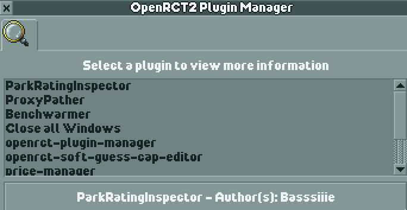

# OpenRCT2 Plugin Manager

A plugin manager for OpenRCT2 (Currently in development)

## Features

- [x] List plugins that you currently have installed
- [] Display information about the plugin on hover
- [] Install plugins from the OpenRCT2 plugin repository
- [] Uninstall plugins
- [] Update plugins
